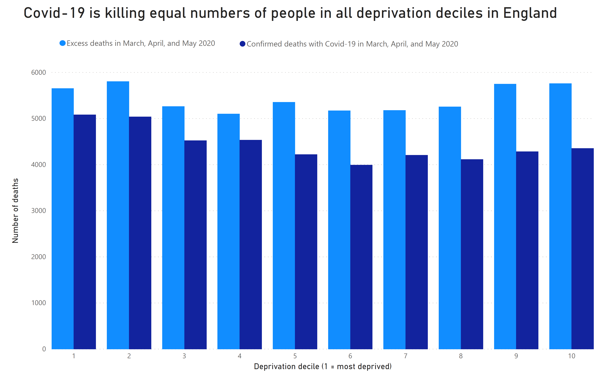

# Covid-19 Excess Deaths by English MSOA and the link with deprivation
Deaths with confirmed Covid-19 and excess deaths during March, April, and May 2020 by MSOA in England aggregated by deprivation decile.

## What is this?
People in England are dying of Covid-19. The ONS have twice (on 1 May and 12 June) published data on the number of people who have died of Covid-19 and by any cause in each of England's MSOA's (neighbourhoods). This is important since at least some and possibly many people who are dying with Covid-19 are not having that written on their death certificates.

Deprivation in England is quantified by the index of multiple deprivation (IMD). I recently improved [The Wikipedia page on IMD](https://en.wikipedia.org/wiki/Multiple_deprivation_index). You should read that page if you don't know what IMDs are. IMDs in England are published by LSOA. About 7 LSOAs joined together form an MSOA. This code calculates deprivation indices for MSOAs in England.

The ONS publish historic death rates by MSOA. This means that we can calculate the excess deaths by MSOA due to Covid-19 (by assuming that all excess deaths in March, April, and May 2020 are due to Covid-19). MSOAs are too small for this data to be statistically very useful, but once we aggregate them by IMD they become very useful. That's what I do in this repository, I calculate the decile of deprivation for every MSOA in England and the number of excess deaths in March, April, and May in that MSOA.

## Are the MSOA deprivation calculations right?
They're probably quite close. I'm not sure how [Alasdair and I have got different answers](https://twitter.com/thomasforth/status/1257086421539618816), but our answers are close enough.

## Are the excess death calculations right?
I think so. We're very lucky that the ONS publish historic deaths by MSOA for England and Wales. And extra lucky that [the three months of March, April, and May 2020 have an almost exactly average death rate, meaning we don't need to seasonally adjust mortality in this period](https://twitter.com/thomasforth/status/1271458772402216961).

## I just want to see the answer!
Covid-19 is causing deaths equally in all deprivation deciles in England. If that surprises you then I don't blame you. I think the ONS have communicated their data poorly and most of the media (notably not ITV Granada and The FT) haven't questioned it enough.

## What about age-standardised mortality rate?
Covid-19 is causing deaths equally in all deprivation deciles in England. But the people who are dying in the most deprived deciles are younger. This means that the age-standarised mortality rate is very substantially higher in the most deprived deciles. The ONS have covered this very well. As long as you understand what their graphs are showing, you should read what they've written, I have nothing to add.

## Who are you Tom? You're probably just wrong.
I may well be wrong. Show me where. Let's get closer to the truth together, in the open.

## Sources
If you look at the code in Program.cs you'll see sources listed in the comments where they are loaded. That's the definitive list. But here's a summary (that may be out of date).
* [Population by LSOA](https://www.ons.gov.uk/peoplepopulationandcommunity/populationandmigration/populationestimates/datasets/lowersuperoutputareamidyearpopulationestimates)
* [Deaths involving Covid-19, exceptional release 01 May 2020](https://www.ons.gov.uk/peoplepopulationandcommunity/birthsdeathsandmarriages/deaths/datasets/deathsinvolvingcovid19bylocalareaanddeprivation)
* [Deaths involving Covid-19, exceptional release 12 June 2020](https://www.ons.gov.uk/peoplepopulationandcommunity/birthsdeathsandmarriages/deaths/datasets/deathsinvolvingcovid19bylocalareaanddeprivation)
* [Historic death count by MSOA for England & Wales](https://www.ons.gov.uk/peoplepopulationandcommunity/birthsdeathsandmarriages/deaths/adhocs/006979numberofdeathsoccurringbymsoaand5yearagegroupsenglandandwales2004to2015)
* [Estimated income by MSOA](https://www.ons.gov.uk/employmentandlabourmarket/peopleinwork/earningsandworkinghours/datasets/smallareaincomeestimatesformiddlelayersuperoutputareasenglandandwales)
* [LSOA to MSOA link table](https://geoportal.statistics.gov.uk/datasets/output-area-to-lsoa-to-msoa-to-local-authority-district-december-2017-lookup-with-area-classifications-in-great-britain)
* [MSOA population estimates](https://www.ons.gov.uk/peoplepopulationandcommunity/populationandmigration/populationestimates/datasets/middlesuperoutputareamidyearpopulationestimates)
* [IMDs by LSOA in England](http://geoportal1-ons.opendata.arcgis.com/datasets/3db665d50b1441bc82bb1fee74ccc95a_0)

## The ONS
The ONS are a national treasure. They are brilliant. And even though I disagree with some of the communication they've done around the analysis they've done in this area, it's still really good. But even better, they release their raw data, so I can check things, and disagree if I want. And *that* is how you generate and maintain trust! Brilliant! Awesome! Ardderchog!

## License
Use my code for whatever you like. MIT licence, or whatever else you like. Seriously, steal it if you like and never give me credit, I don't care. But it would be nice to link to me.

But I'm also sharing raw data, and that's almost certainly Open Government Licence. I think we're safe from the dreaded Royal Mail, but you probably want to check before creating your megabucks startup. So yeah, probably [Open Government Licence](http://www.nationalarchives.gov.uk/doc/open-government-licence/version/3/).
